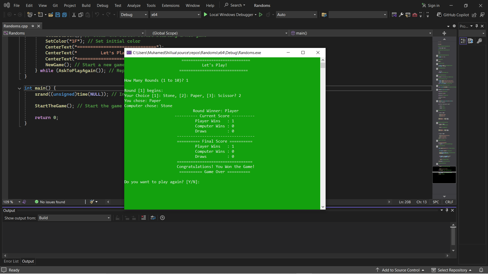

# Rock Paper Scissors Game

## Overview
A console-based Rock-Paper-Scissors game developed in C++.
Players compete against the computer in multiple rounds.
The game dynamically updates the score, provides color-coded feedback based on the result of each round, and highlights the overall winner at the end.

## Features
- Clean and well-structured console output
- Real-time score tracking with player vs computer
- Visual feedback using color changes based on round outcome:
  - Green for Player Win
  - Red for Computer Win
  - Yellow for Draw
- Final winner displayed with a highlighted message
- Option to replay after completing a set of rounds

## How to Run

1. **Clone the repository:**

    ```bash
    git clone https://github.com/Muhamed-Shillua/RockPaperScissors-Game.git
    cd RockPaperScissors-Game
    ```

2. **Compile the code using a C++ compiler (e.g., g++):**

    ```bash
    g++ main.cpp -o game
    ```

3. **Run the game:**

    ```bash
    game.exe
    ```

> **Note:** This game is designed to work on Windows due to the use of the `windows.h` library for color management in the console.

## Screenshot


## Learning Objectives
This project was developed to improve the following skills:
- Designing clean and intuitive console-based UIs
- Enhancing code readability and maintainability
- Managing user input and output effectively in C++
- Implementing game loops and game logic flow

## Future Enhancements
- Adding multiplayer support (local or online)
- Porting the game to Linux using ANSI escape codes for color output
- Implementing score history and saving game data to a file

## Contact
For any feedback, suggestions, or issues, feel free to open an issue on the [GitHub repository](https://github.com/Muhamed-Shillua/RockPaperScissors-Game/issues).
